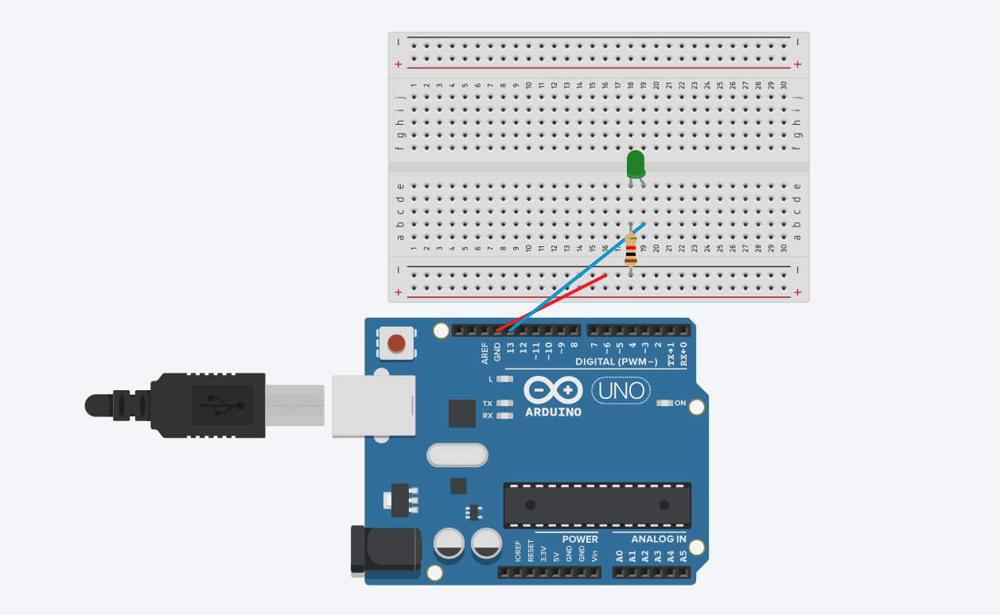
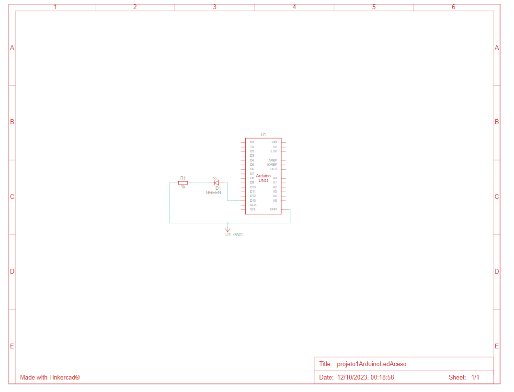
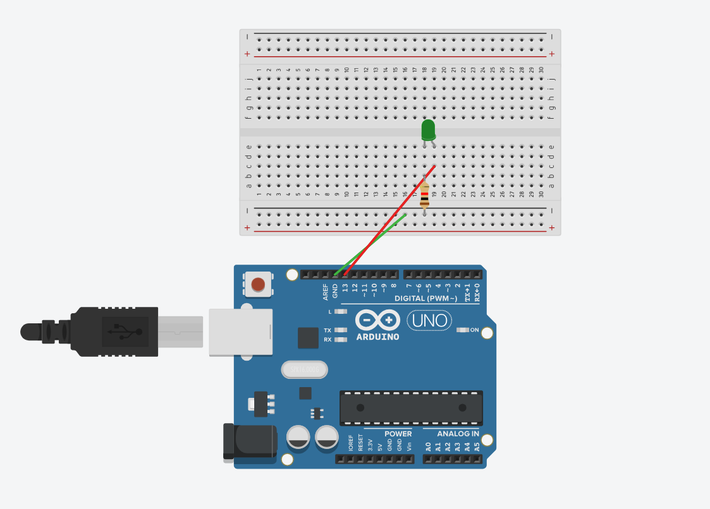
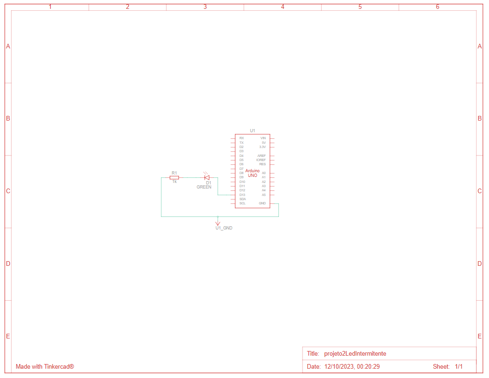

# primeirosProjetos-Arduino
uns dois projetos de arduino para começar a aprender

  <h3>Primeiro que eu fiz com led que fica aceso assim que liga</h3>
   

  

  <h3>Nesse, o led fica apagando e acendendo de tantos em tantos milésimos de segundo</h3>
   

  
